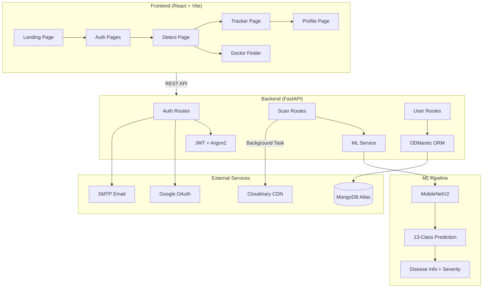

# SkinAi – Skin Disease Detection & Healing Tracker

SkinAi is an advanced AI-powered application designed to help users detect skin diseases and track their healing progress over time. Built with a modern tech stack, it combines deep learning for image analysis with a secure and user-friendly web interface.

## 🚀 Features

-   **AI Skin Disease Detection**: Upload an image of a skin condition to get an instant analysis and potential diagnosis.
-   **Healing Progress Tracker**: Compare images over time to visualize and track healing progress with side-by-side comparisons and percentage improvements.
-   **Secure Authentication**:
    -   Google Sign-In integration.
    -   Email/Password authentication with OTP verification.
-   **User Dashboard**: Personalized dashboard to manage scans, track history, and view reports.
-   **Modern UI/UX**: A responsive and aesthetic interface built with React and Tailwind CSS.

## 🏗️ Architecture




## 🛠️ Tech Stack

### Frontend
-   **React** (Vite)
-   **Tailwind CSS** (Styling)
-   **Lucide React** (Icons)
-   **Framer Motion** (Animations)

### Backend
-   **FastAPI** (Python)
-   **MongoDB** (Database)
-   **TensorFlow/Keras** (AI Model - *implied*)
-   **Pydantic** (Data Validation)

## 📦 Installation & Setup

Follow these steps to get the project running locally.

### Prerequisites
-   Node.js & npm installed.
-   Python 3.8+ installed.
-   MongoDB installed and running (or a MongoDB Atlas connection string).

### 1. Clone the Repository

```bash
git clone https://github.com/prince-0045/SkinAi.git
cd SkinAi
```

### 2. Backend Setup

Navigate to the backend directory and set up the Python environment.

```bash
cd backend
python -m venv venv
```

Activate the virtual environment:
-   **Windows**: `venv\Scripts\activate`
-   **Mac/Linux**: `source venv/bin/activate`

Install dependencies:
```bash
pip install -r requirements.txt
```

**Environment Configuration (.env)**
Create a `.env` file in the `backend` directory with the following variables:
```env
MONGODB_URL=mongodb://localhost:27017/skinai  # Or your MongoDB Atlas URL
SECRET_KEY=your_secret_key_here
ALGORITHM=HS256
ACCESS_TOKEN_EXPIRE_MINUTES=30

# Email Configuration (for OTP)
MAIL_USERNAME=your_email@gmail.com
MAIL_PASSWORD=your_app_password
MAIL_FROM=your_email@gmail.com
MAIL_PORT=587
MAIL_SERVER=smtp.gmail.com

# Google Auth
GOOGLE_CLIENT_ID=your_google_client_id
```

Run the backend server:
```bash
uvicorn app.main:app --reload
```
The backend will run at `http://localhost:8000`.

### 3. Frontend Setup

Open a new terminal, navigate to the frontend directory, and install dependencies.

```bash
cd frontend
npm install
```

**Environment Configuration (.env)**
Create a `.env` file in the `frontend` directory:
```env
VITE_API_URL=http://localhost:8000
VITE_GOOGLE_CLIENT_ID=your_google_client_id
```

Run the frontend development server:
```bash
npm run dev
```
The application will usually run at `http://localhost:5173`.

## 📖 API Usage Examples

Here are examples of how to consume the SkinAi backend API from external clients.

### 1. Upload a Image for Analysis
**Endpoint:** `POST /api/v1/scan/upload`
**Auth:** Bearer Token

```bash
curl -X POST "http://localhost:8000/api/v1/scan/upload" \
  -H "Authorization: Bearer YOUR_TOKEN_HERE" \
  -H "accept: application/json" \
  -H "Content-Type: multipart/form-data" \
  -F "file=@/path/to/your/skin-image.jpg"
```

### 2. Retrieve Scan History (with Cache Headers)
**Endpoint:** `POST /api/v1/scan/history`
**Auth:** Bearer Token

```bash
curl -X GET "http://localhost:8000/api/v1/scan/history" \
  -H "Authorization: Bearer YOUR_TOKEN_HERE" \
  -H "accept: application/json"
```

---

## 🚀 Production Deployment Guide

For a highly available production environment, follow these best practices rather than the local dev commands.

### Backend (Gunicorn + Uvicorn Workers)
Do not use raw `uvicorn` in production. Run with Gunicorn to manage multiple worker processes and prevent the ML model from blocking connections.
```bash
# Recommended: 4 workers for standard VMs
gunicorn app.main:app -w 4 -k uvicorn.workers.UvicornWorker --bind 0.0.0.0:8000
```

*Ensure `MONGO_URL` points to a scaled cluster (Atlas Tier M10+) and your Cloudinary quota is sufficient.*

### Frontend (Nginx/Vercel)
The standard `npm run dev` is not for production.

1. Build the production application (creates the PWA artifacts):
   ```bash
   npm run build
   ```
2. Serve the `dist/` directory using **Nginx**, **Vercel**, or **Netlify**. Ensure Single Page App (SPA) routing is configured so all paths fall back to `index.html`.

## 🤝 Contributing

Contributions are welcome! Please fork the repository and create a pull request with your changes.

